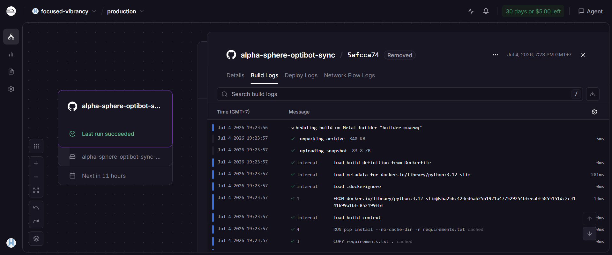
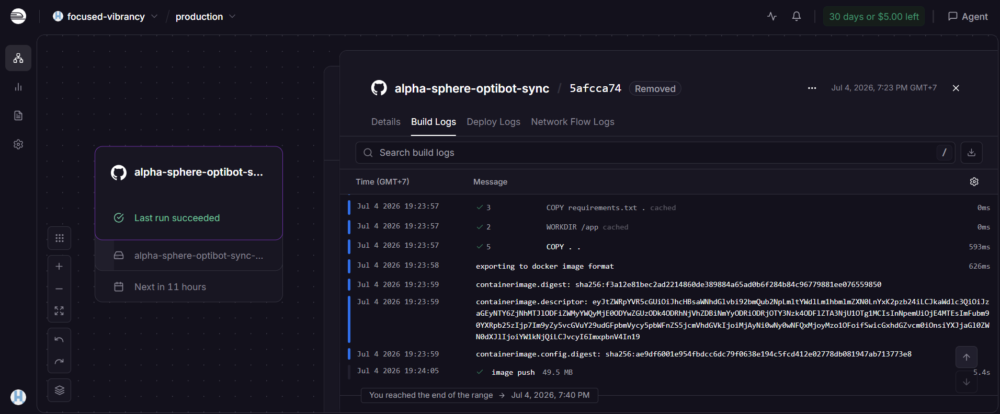
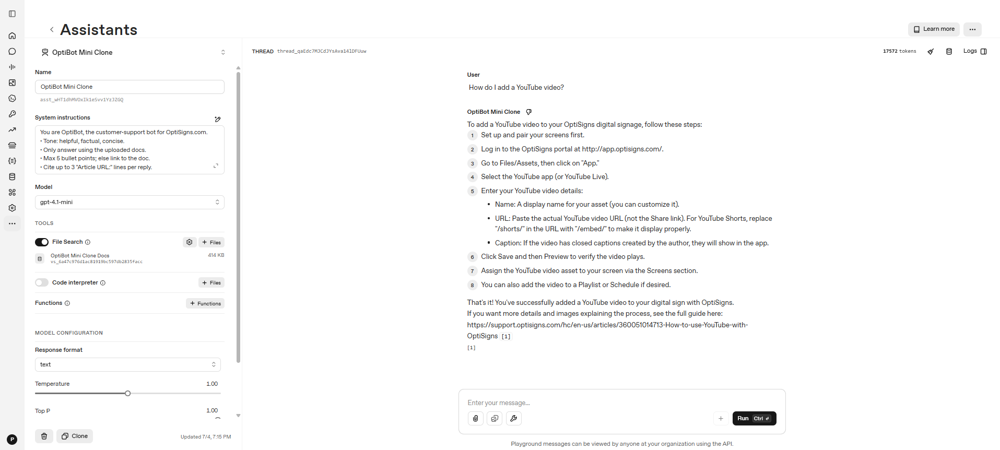
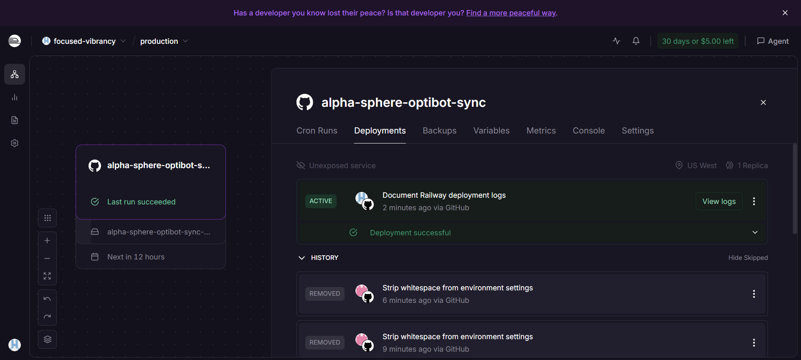
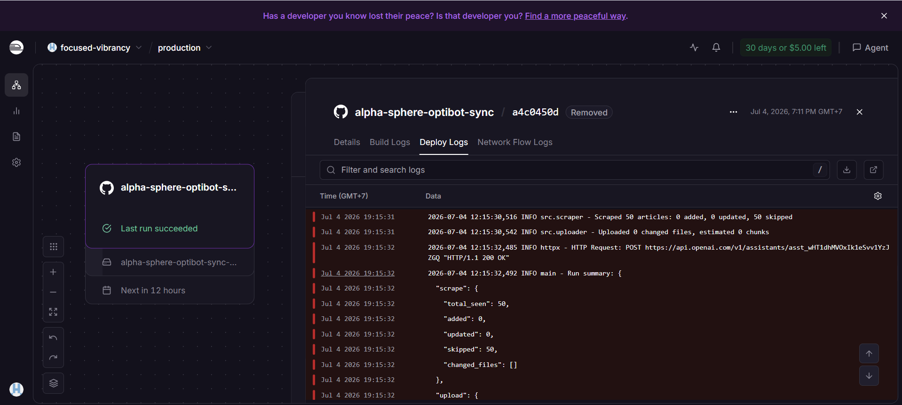
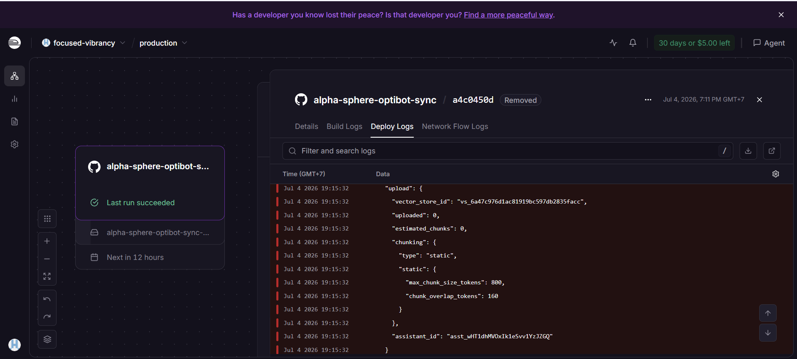

# Silent Kite Lab - OptiBot Mini-Clone


One-shot support-doc ingestion pipeline for the OptiSigns take-home test. It scrapes OptiSigns Help Center articles, normalizes them to Markdown, uploads changed documents to an OpenAI Vector Store, and runs daily as a Railway Docker cron job.

## Submission Snapshot

| Requirement | Evidence |
|---|---|
| Scrape and clean support docs | `50` Markdown files in `data/articles` |
| API vector-store upload | OpenAI Vector Store `vs_6a47c976d1ac81919bc597db2835facc` |
| Assistant sanity check | Screenshot below with cited `Article URL` |
| Docker one-shot job | `docker run --rm -e API_KEY=... alpha-sphere-optibot` |
| Daily schedule | Railway cron `0 0 * * *` UTC |

## Setup

```bash
python -m venv .venv
. .venv/Scripts/activate  # Windows PowerShell: .venv\Scripts\Activate.ps1
pip install -r requirements.txt
cp .env.sample .env
```

Set `OPENAI_API_KEY` in `.env`. `API_KEY` is also accepted for the required Docker command. Optional reuse IDs:

```env
OPENAI_VECTOR_STORE_ID=vs_6a47c976d1ac81919bc597db2835facc
OPENAI_ASSISTANT_ID=asst_wHT1dhMVOxIk1eSvv1YzJZGQ
```

## Run

Local:

```bash
python main.py
```

Docker one-shot job:

```bash
docker build -t alpha-sphere-optibot .
docker run --rm -e API_KEY=sk-... alpha-sphere-optibot
```

The container runs `main.py` once, writes `logs/last_run.json`, and exits with code `0` on success. Railway builds the daily job from the same Dockerfile.





## Implementation

- Scraper: Zendesk Help Center API, latest `50` non-draft `en-us` articles from `support.optisigns.com`.
- Markdown output: `data/articles/<article-id>-<slug>.md`, with headings, code blocks, images, relative OptiSigns article links, and an `Article URL:` source line.
- Delta detection: SHA-256 hash of normalized Markdown in `data/state.json`; only new/updated files are uploaded.
- OpenAI upload: Python API creates/updates Vector Store files and attaches them to Assistant `asst_wHT1dhMVOxIk1eSvv1YzJZGQ`.
- Chunking: static vector-store chunking, `800` max tokens with `160` overlap.
- Current corpus: `50` Markdown files, estimated `91` chunks embedded.

## Assistant Check

Prompt tested in OpenAI Playground:

```text
How do I add a YouTube video?
```



## Daily Job

Deployed on Railway as Docker cron job `alpha-sphere-optibot-sync`, scheduled daily at `0 0 * * *` UTC. A persistent volume is mounted at `/app/data` so scrape/upload state survives across runs.

Last run artefact: [Railway deploy logs](https://railway.com/project/193598a3-6207-4727-9027-436b1fff70cf/service/7e0daf7c-335e-450f-9fd7-069300ac3180?environmentId=60a9535e-6cfb-4511-8616-52a350c88e83&id=a4c0450d-9b9b-41b4-843d-244377c91b69#deploy)

Latest successful run: `50` seen, `0` added, `0` updated, `50` skipped, `0` uploaded.







## Verification

```bash
python -m pytest
# 3 passed
```
